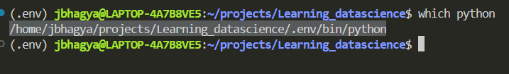
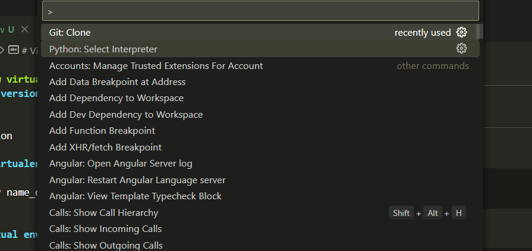
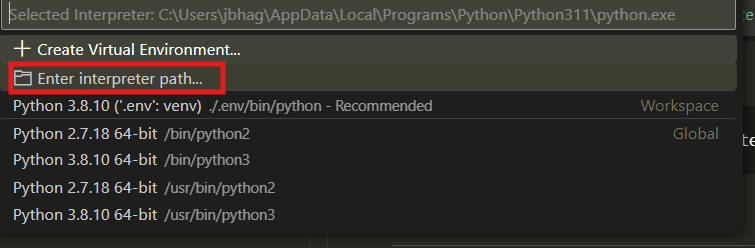
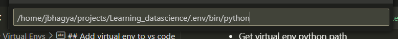

# Virtual Envs
## Creating new virtual envs
**Check python version:**

```
python3 --version
```
**Create new virtualenv**
```
python3 -m venv name_of_your_environment

```
**Activate virtual env**
```
source path_to_your_env/bin/activate
```
## Add virtual env to vs code 
- Get virtual env python path

- press `clt+shift+p` , select python interpreter

- Select interpreter path



## Install packages
` python -m pip install package_name `